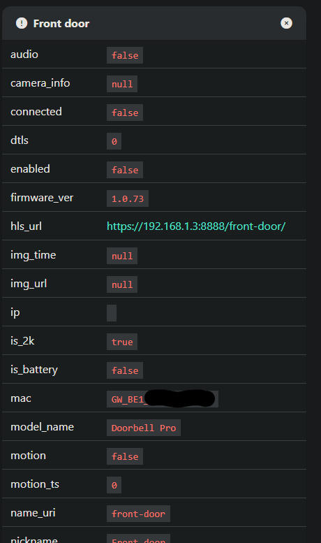

Hello!

This is a rough RTSP server for WYZE cameras of the GWELL variety

## preface
THANK YOU to Carson Loyal (carTloyal123) for the libraries to connect and get streams and pedroSG94 for RTSP related android libraries. I used the following repos:
- [cryze-android](https://github.com/carTloyal123/cryze-android) - the library for connecting to the cameras
- [cryze](https://github.com/carTloyal123/cryze) - scripts for getting tokens, capturing raw stream contents
- [RootEncoder](https://github.com/pedroSG94/RootEncoder) - library for streaming RTSP
- [RTSP-Server](https://github.com/pedroSG94/RTSP-Server) - library for serving RTSP streams

## Features
- *uses local streaming by default*
- provides one rtsp/MJPEG/raw server per camera, additional details below
- runs well in docker when a GPU is available, RAW is suggested. see frigate config below for how to use.

## Prereqs
- An x86 machine. I am using libhoudini in `redroid` to make the cryze android app work with the binaries for getting connections. This avoids the overhead of qemu or other android emulators.
- a kernel compatible with `redroid`. follow [this guide](https://github.com/remote-android/redroid-doc/blob/master/deploy/README.md), optionally starting a redroid container to confirm it works
- Wyze GWELL cameras. I've tested with `GW_GC1` (Wyze Cam OG) and `GW_BE1` (Wyze Cam Doorbell Pro	), 3 concurrent streams seems stable.

To use this, docker compose is easiest.
1) copy `sample.env` to `.env` - update your details. Wyze API keys can be shared with `wyze-bridge` NOTE: I messed up and didnt exactly use the same variable names as `wyze-bridge` and I need to fix this. as such, there are duplicates.
2) update the `docker-config.yml` with the redroid configs specific to your kernel and GPU. This could involve changing some props, it could involve volume mapping your GPU. I'm running on a Minisforum NAB6 with an intel i7-12650H on Arch with the Zen kernel.
3) Optional: Expose the ports you mapped your cameras to in `.env` from the android container - I personally just share a network between frigate and this project so that I don't need to.
4) build and start the thing:
```bash
docker compose build
docker compose up -d
```

you can view the android container over adb with something like scrcpy: `scrcpy -s localhost:5555` - that repo is [here](https://github.com/Genymobile/scrcpy)

## Support
I am not tech support, I am sorry, but I just do not have time. To debug the android half, you _will_ need to use logcat/a debugger/android studio. logcat is flushed to docker logs, but it is not filtered and Android is notoriously chatty. For some of the things I found myself fixing while developing this, checkout [this guide](TROUBLESHOOTING.md).

## Development
I am using Android Studio for the android app, and just attaching to my remote docker-hosted `redroid` container (`adb connect [arch box ip address]:5555`). debugging/remote builds work, but container reboots will not persist your `/data` partition, so be sure to rebuild/restart with updated sources. (step 3 above)

## HELP NEEDED
- rewrite `RtspStream` to allow us to pass the raw packets from `AVData` on `IVideoDecoder.receive_frame` or `IVideoDecoder.send_packet` to remove _both_ `MediaCodec`s involved with _each_ camera's stream. This would significantly reduce the resource utilization.
- move the complete use of the python `wyze_sdk` library into the android app to allow the android app to run independent of the webservice.
- deal with camera events like disconnects/connects
- move to the latest version of IoTVideoSDK

## Camera configurations
There are three server types that the android container can provide, all three have advantages and disadvantages:
- RTSP - Just works, but requires good hardware accelleration support, of which is flakey in Redroid.
- MJPEG - visible in a browser, re-renderable in ffmpeg, but uses absolutely no hardware accelleration and will only accept one connection at a time so its best used for testing.
- RAW - gives you a raw h264 stream straight out of the IotVideoPlayer library, which requires zero hardware accelleration. This will also only accept one connection at a time, but using ffmpeg, this gives you the best flexability.

The CAMERA_IDS variable is a comma seperated list of cameras, id:port:serverType

for example: `CAMERA_IDS=GW_BE1_LONGNAMEHERE:8000:RAW,GW_BE1_ANOTHERONE:8001:RTSP`
- camera GW_BE1_LONGNAMEHERE will have a h264 server running on 8000
- camera GW_BE1_ANOTHERONE will have a RTSP server running on 8001

You can get your camera IDs a couple ways, the easiest way if you run docker-wyze-bridge is to look at the all cameras tab and expand the details on your favorite gwell camera and grab the `mac` field:


# RAW server type use
`ffmpeg -i tcp://<ip-of-android-container>:8001 -f flv -listen 1 rtmp://0.0.0.0:1234` - Makes a rtmp stream avalible at rtmp://<your IP>:1234
`ffmpeg:tcp://cryze_android_app:8001?video=0#video=h264` - web2rtc url, see full example below as I use in frigate

My personal docker-compose.yml is combined with a frigate and wyze-bridge container to consolidate everything

```yaml
networks:
  frigate:
    driver: bridge

services:
  wyze-bridge:
    container_name: wyze-bridge
    restart: unless-stopped
    image: mrlt8/wyze-bridge:latest
    networks:
      - frigate
    ports:
      - 5004:5000 # WEB-UI
    environment:
      ON_DEMAND: True
      LLHLS: True
      WYZE_EMAIL: ${WYZE_EMAIL}
      WYZE_PASSWORD: ${WYZE_PASSWORD}
      API_ID: ${WYZE_API_ID}
      API_KEY: ${WYZE_API_KEY}
      WB_AUTH: False # Set to false to disable web and stream auth.

  frigate:
    container_name: frigate
    privileged: true # this may not be necessary for all setups
    restart: unless-stopped
    image: ghcr.io/blakeblackshear/frigate:stable
    shm_size: "256mb" # update for your cameras based on calculation in frigate docs
    networks:
      - frigate
    volumes:
      - /etc/localtime:/etc/localtime:ro
      - ./config:/config
      - ./storage:/media/frigate
      - type: tmpfs # Optional: 1GB of memory, reduces SSD/SD Card wear
        target: /tmp/cache
        tmpfs:
          size: 1000000000
    ports:
      - "8971:8971"
      - "5005:5000" # Internal unauthenticated access. Expose carefully.
      - "8554:8554" # RTSP feeds
      - "8555:8555/tcp" # WebRTC over tcp
      - "8555:8555/udp" # WebRTC over udp
    environment:
      FRIGATE_RTSP_PASSWORD: "password"

  cryze_api:
    networks:
      - frigate
    build:
      context: ./cryze_api
      dockerfile: Dockerfile
    ports:
      - 8080:8080
    env_file:
      - .env

  cryze_android_app:
    networks:
      - frigate
    build:
      context: ./cryze_android_app
      dockerfile: Dockerfile
    privileged: true
    ports:
      - 5555:5555
    entrypoint:
      - /system/bin/launcher
      - qemu=1
      - androidboot.hardware=redroid
      - androidboot.redroid_net_ndns=1
      - androidboot.redroid_net_dns1=127.0.0.11
# see the redroid docs for configs below here, they are OS specific
      - androidboot.use_memfd=1
      - androidboot.redroid_gpu_mode=host
      - androidboot.redroid_gpu_node=/dev/dri/renderD128
```

I am using frigate with a config like this:
```yaml
go2rtc:
  streams:
    doorbell: ffmpeg:tcp://cryze_android_app:8001?video=0#video=h264

cameras:
  doorbell:
    enabled: true
    ffmpeg:
      retry_interval: 0
      inputs:
        - path: rtsp://127.0.0.1:8554/doorbell
          input_args: preset-rtsp-restream
          roles:
            - detect
    detect:
      width: 1440
      height: 1440
      enabled: true
```

## License
- All files in `cryze_android_app/app/src/main/java/com/pedro` and copied works from `RootEncoder` and `RTSP-Server` remain licensed Apache v2 per the code's source repositories (linked above)
- Remaining files not from named repos above, or missing copyright headers are licenses GPL v3, see the copy of that license located [here](LICENSE)
