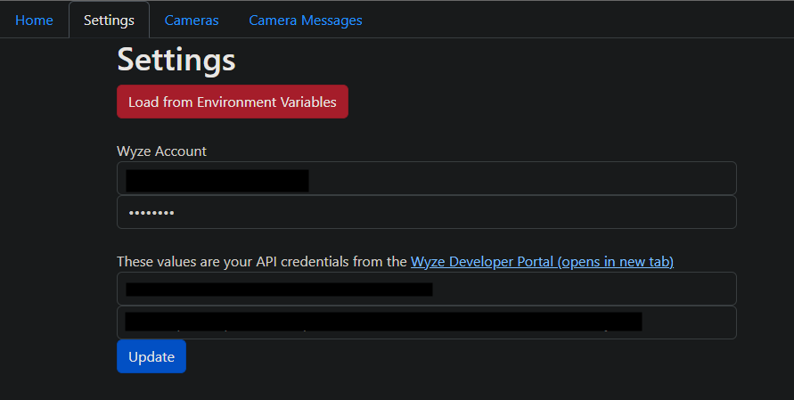
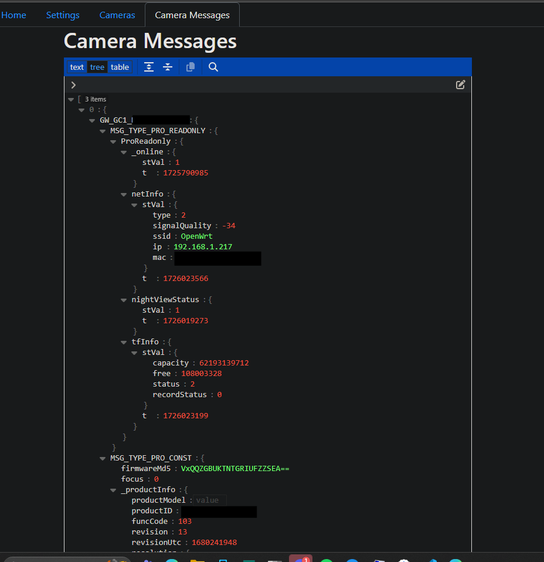

Hello!

This is a RTSP server for WYZE cameras of the GWELL variety.

## preface
THANK YOU to Carson Loyal (carTloyal123) for the libraries to connect and get streams and pedroSG94 for RTSP related android libraries. I used the following repos:
- [cryze-android](https://github.com/carTloyal123/cryze-android) - the library for connecting to the cameras
- [cryze](https://github.com/carTloyal123/cryze) - scripts for getting tokens, capturing raw stream contents
- [RootEncoder](https://github.com/pedroSG94/RootEncoder) - library for streaming RTSP
- [MediaMTX](https://github.com/bluenviron/mediamtx) - handles (re)serving the content that the android component remuxes

## Features
- *uses local streaming by default*
- provides one stream in MediaMTX, configured at the UI (port 8080)
- scrapes your account at startup and automatically adds all supported wyze gwell-based cameras
- runs well in docker

## Prereqs
- An x86 machine. I am using libhoudini in `redroid` to make the cryze android app work with the binaries for getting connections. This avoids the overhead of qemu or other android emulators.
- a kernel compatible with `redroid`. follow [this guide](https://github.com/remote-android/redroid-doc/blob/master/deploy/README.md), optionally starting a redroid container to confirm it works
- Wyze GWELL cameras. I've tested with `GW_GC1` (Wyze Cam OG) and `GW_BE1` (Wyze Cam Doorbell Pro	), 3 concurrent streams seems stable.

To use this, docker compose is easiest.
1) copy `sample.env` to `.env` - update your details. Wyze API keys can be shared with `wyze-bridge`, uses the same variables:
```env
WYZE_EMAIL=
WYZE_PASSWORD= 
API_ID=
API_KEY= 
```
2) Optional: Expose the ports you mapped your cameras to in `.env` from the android container - I personally just share a network between frigate and this project so that I don't need to. See the example `docker-compose.yml` files in this repo.
3) build and start the thing:
```bash
docker compose build
docker compose up -d
```

you can view the android container over adb with something like scrcpy: `scrcpy -s localhost:5555` - that repo is [here](https://github.com/Genymobile/scrcpy)

## Support
File an issue with as much detail as you can. I have limited time to work on this, but I'll try to help. I've replaced my wyze-gwell cameras with tapo c120's for better low-light support and native RTSP, but I will attempt to repro anything you might run into.

## Development
I am using Android Studio for the android app, and just attaching to my remote docker-hosted `redroid` container (`adb connect [arch box ip address]:5555`). debugging/remote builds work, but container reboots will not persist your `/data` partition, so be sure to rebuild/restart with updated sources. If you need to stop the running cryze version, `adb shell setprop breakloop 1` will stop the loop that ensures cryze is running. You'll need to uninstall the current version to install your local build and android studio isn't very good at figuring this out.

If you choose to build the android app locally, you can override the rtsp server and cryze_api URI.
- `CRYZE_RTSP_SERVER=localhost` - if your using the in-container rtsp server, its at localhost
- `CRYZE_BACKEND_URL=http://cryze_api:8080` - You could totally point this to your dev machine

The api solution, you can just `dotnet watch run` or if you don't want to do that, `docker build -t cryzeapi . ; docker run --rm -it --env-file=..\.env -v=".\data.json:/data/data.json" -p="8080:8080" cryzeapi`

## HELP NEEDED (backlog?)
- move to the latest/a newe version of IoTVideoSDK
- render events on the API server in some sort of view, there's some cool data in the event stream. I made classes to deserialize the events into.

## Camera configurations
The configuration is one of three ways:
1) webui, port 8080
2) edit the json yourself
3) just let the app scrape your cameras
4) set the WyzeSdkServiceConfiguration__ValidMarsDevicePrefix environment variable `=device1,device2,etc` in your docker-compose on the API service and restart. on reboot, it will only scrape and add devices matching whatever you set (as a prefix, which can also be the entire device name)
5) if you do not set your own route, the default route is live/nickname - where nickname is all lowecase and spaces are underscores

## Webapp
Account Settings:



Camera Editor:


Message Viewer:


The homepage might soon have a live view of your cameras.

## License
- All files in `cryze_android_app/app/src/main/java/com/pedro` that are copied works from `RootEncoder` and remain licensed Apache v2 per the code's source repositories (linked above) My changes are licensed GPLv3 (RTSP codec extensions) unless it can be proven my changes are incompatible, in which case they retain the Apache v2 license from `RootEncoder`
- Remaining files not from named repos above, or missing copyright headers are licenses GPL v3, see the copy of that license located [here](LICENSE)
- IoTVideoSDK is complicated. I rewrote _most_ of the SDK from scratch using only the needed JNI extensions for the binary blobs to be happy. My changes are also GPLv3, the rest are public domain (untouched java primairly).
- I do not own or claim any personal stake to the NDK libraries this uses. They are readily available on the internet in several forms.
